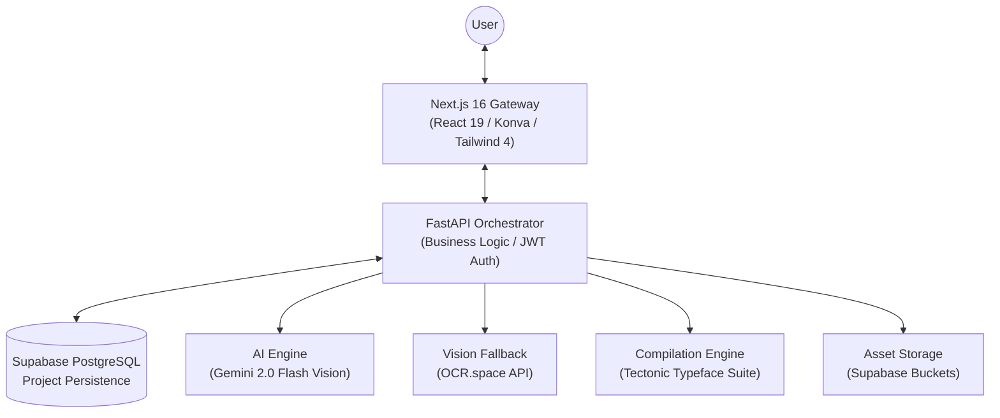
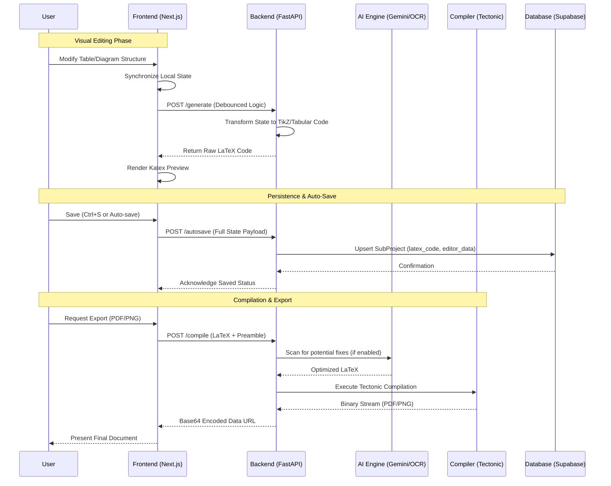

# TizKit — The Ultimate LaTeX Engineering Platform 🚀

[](https://nextjs.org/)
[](https://fastapi.tiangolo.com/)
[](https://supabase.com/)
[](LICENSE)

**TizKit** is a professional-grade, full-stack platform designed to bridge the gap between complex LaTeX typesetting and intuitive visual design. By integrating high-performance interactive editors with cutting-edge AI Vision models, TizKit empowers researchers, students, and engineers to generate publication-quality diagrams, tables, and documents with unprecedented speed and precision.

---

## 🏗 System Architecture & Design

TizKit is built on a distributed service architecture designed for high availability, low-latency live previews, and robust data persistence.

### 🧩 High-Level System Design
The platform architecture separates the heavy lifting of LaTeX compilation and AI processing from the user-facing reactive interface.



### ⚡ Complete API & Data Lifecycle
This sequence illustrates the sophisticated synchronization between the visual editor state, AI reconstruction, and final document compilation.



---

## 💎 Premium Feature Ecosystem

### 📊 Professional Table Engineering
The TizKit Table Editor isn't just a grid; it's a precision tool for document styling.
- **Structural Agility**: Move rows up/down and columns left/right with instant LaTeX recalculation.
- **Precision Deletion**: Delete specific rows/columns while maintaining a 1x1 safety minimum.
- **Granular Styling**: Individual cell control for background colors, text colors, font-weight (bold), and semantic alignment (Left/Center/Right).
- **Sticky Controls**: Optimized for large data sets, management bars stay locked to the viewport for fluid editing.

### 📐 TikZ Schema Designer
Convert visual intuition into production-ready TikZ code.
- **Interactive Canvas**: Drag-and-drop nodes (rectangles, circles, diamonds) with smart connection snapping.
- **Auto-TikZ Engine**: Real-time generation of optimized TikZ code, ensuring perfect alignment and standard library compliance.
- **Live Sync**: Visual modifications immediately reflect in the synchronized LaTeX editor panel.

### 🧠 AI Vision Pipeline
- **Image-to-LaTeX Integration**: Upload images of equations or text; TizKit uses Gemini Vision to reconstruct the LaTeX source with high fidelity.
- **Handwritten Flowcharts**: A unique service that interprets hand-drawn sketches and outputs structured TikZ code.
- **Intelligent LaTeX Fixer**: Compilations errors are intercepted by AI to provide plain-English explanations and automated "Quick Fix" suggestions.

### 📁 Research Organization
- **Project Hierarchies**: Organize documents into "Mother Projects" containing multiple related sub-projects (Diagrams, Tables, Docs).
- **Global Templates**: Define project-wide LaTeX preambles and packages once; apply them to all sub-projects automatically.
- **Instant Clipboard**: One-click copying of generated LaTeX code, formatted for immediate use in external editors like Overleaf.

---

## 🛠 Advanced Technical Stack

### **Frontend Architecture**
- **Core**: Next.js 16 (App Router) & React 19.
- **Visuals**: Tailwind CSS 4 for a ultra-premium dark/glassmorphic aesthetic.
- **Interaction**: Lucide React for iconography; `sonner` for non-intrusive notification toasts.
- **Canvas Logic**: `react-konva` for complex diagram manipulation.
- **Rendering**: KaTeX for mathematics and `react-pdf` for document previews.

### **Backend Architecture**
- **Core**: FastAPI (Asynchronous Python 3.10+).
- **Data Layer**: SQLModel with SQLAlchemy for typed, secure database interactions.
- **Auth**: Robust JWT-based authentication with bcrypt hashing.
- **LaTeX Suite**: Tectonic for efficient, on-the-fly compilation.
- **Vision**: Integrated Gemini 2.0 Flash Vision and OCR.space service layers.

---

## 🚀 Deployment & Development Guide

### 🧱 Prerequisites
- **Python 3.10+** (Backend)
- **Node.js 20+** (Frontend)
- **PostgreSQL** or a **Supabase** instance.
- **Tectonic LaTeX Engine**: Required for document compilation.
- **Poppler**: Required for PDF-to-image conversion during previews.

### 📂 Unified Setup Instructions

1. **Repository Initialization**:
   ```bash
   git clone https://github.com/Mehedi26696/Latex-Helper---Tizkit.git
   cd Latex-Helper---Tizkit
   ```

2. **Backend Configuration**:
   ```bash
   cd backend
   python -m venv venv
   source venv/bin/activate # Windows: .\venv\Scripts\Activate.ps1
   pip install -r requirements.txt
   # Generate environment file from template
   copy .env.example .env
   # Execute application
   python main.py
   ```

3. **Frontend Configuration**:
   ```bash
   cd frontend
   npm install
   # Configure environment
   echo "NEXT_PUBLIC_API_URL=http://localhost:8000" > .env.local
   # Launch Dev Server
   npm run dev
   ```

### 🔐 Environment Variable Reference
| Variable | Description | Example |
|----------|-------------|---------|
| `DATABASE_URL` | PostgreSQL connection string | `postgresql://...` |
| `GEMINI_API_KEY` | Google AI Studio Key | `AIzaSy...` |
| `TECTONIC_PATH` | Full path to tectonic executable | `C:\bin\tectonic.exe` |
| `POPPLER_PATH` | Path to Poppler `bin` folder | `C:\poppler\bin` |

---

## 📝 Keyboard Productivity

TizKit includes a built-in "Power User" layer to accelerate document creation.
- **`Ctrl + S`**: Instant project synchronization to cloud.
- **`Ctrl + E`**: Toggle Compilation & Export interface.
- **`Ctrl + P`**: Force-refresh LaTeX live preview.
- **`Esc`**: Close active modals or clear selection.

---

## 🤝 Support & Contribution
TizKit is built by researchers, for researchers. 
- **GitHub Issues**: Report bugs or request advanced LaTeX environments.
- **Discussion**: Share your custom templates or TikZ schemas.

---

**Crafted with ❤️ for the LaTeX Community.**
