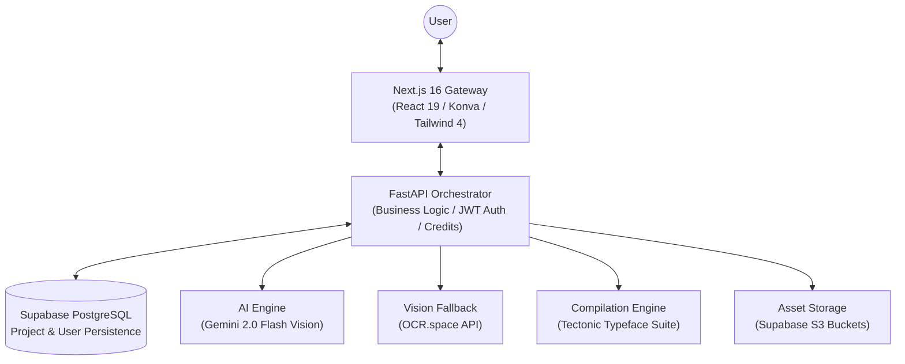
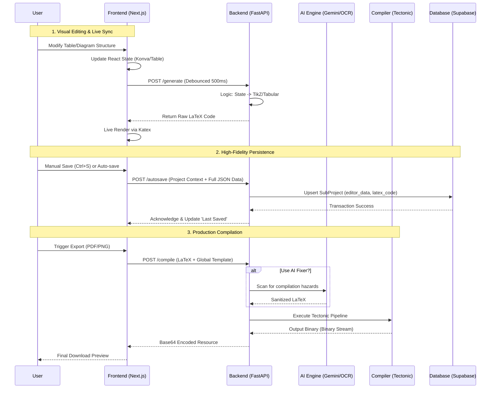

# TizKit — The Ultimate LaTeX Engineering Platform 🚀

[](https://nextjs.org/)
[](https://fastapi.tiangolo.com/)
[](https://supabase.com/)
[](LICENSE)

**TizKit** is a professional-grade, full-stack platform designed to revolutionize the way researchers, students, and engineers interact with LaTeX. By bridging the gap between complex typesetting code and intuitive visual design, TizKit provides a high-fidelity environment for generating publication-quality diagrams, tables, and documents through interactive editors and state-of-the-art AI Vision.

---

## 🏗 System Architecture & Service Design

TizKit is built on a distributed service architecture optimized for high concurrency, real-time visual feedback, and reliable data persistence via a cloud-native database.

### 🧩 High-Level System Overview
The architecture is designed to offload expensive operations (LaTeX compilation, AI inference) to specialized services while maintaining a fluid, low-latency UI.



### ⚡ Complete API & Data Lifecycle
This lifecycle diagram tracks a single user interaction from visual manipulation to permanent cloud storage and final PDF export.



---

## 💎 Premium Feature Ecosystem

### 📊 Professional LaTeX Table Engineering
TizKit features a "Grid-first" editor that handles the complexity of `tabular`, `booktabs`, and `xcolor` packages automatically.
- **Structural Fluidity**: Drag-and-drop rows and columns. Swap indices with instant index-remapping.
- **Micro-Styling**: Cell-level control for hex-accurate background/text colors, semantic alignment (Left/Center/Right), and font weight.
- **Safety Constraints**: Built-in 1x1 minimum size validation and recursive index updating to prevent data loss during deletions.
- **Sticky UI**: The "Sticky Management" HUD ensures control buttons for rows/columns are always available, even in horizontally or vertically scrolling large tables.

### 📐 TikZ Schema Canvas
A full implementation of the TikZ library within a web-based interactive canvas.
- **Reactive Canvas**: Powered by `react-konva`, allowing for node dragging, smart connection snapping, and dynamic resizing.
- **Object Library**: Premade library of rectangles, circles, diamonds, and logic gates.
- **Connection Logic**: Intelligent arrows that track node movements to maintain diagram integrity.
- **Live TikZ Output**: The backend transforms the canvas JSON into structured, clean TikZ code suitable for any professional paper.

### 🧠 AI Vision Pipeline
- **Image-to-LaTeX**: High-accuracy extraction of mathematical formulas using Gemini 2.0 Flash Vision.
- **Handwritten Interpretation**: Specialized service that converts hand-drawn flowchart sketches into structured TikZ `\node` and `\draw` commands.
- **Error Intelligence**: When compilation fails, the AI analyzes the Tectonic logs to provide plain-English explanations and specific code fixes.

### 📜 Hierarchical Project Management
- **Mother Projects**: Top-level containers that store shared assets, linked files, and metadata.
- **Sub-Projects**: Specialized editors for Tables, Diagrams, and Documents nested within a Mother Project.
- **Template System**: Define a global `preamble` (LaTeX packages, custom commands) at the user level to ensure all generated segments are styled consistently.

### 💳 Credits & Usage Control
- **Usage-Based Economy**: Integrated credit system that tracks API usage (AI calls, compilations).
- **Subscription Tiers**: Support for Free, Pro, and Team plans with different daily limits.
- **Transaction Logs**: Full transparency on credit consumption per service call.

---

## 🛠 Elite Technology Stack

### **Frontend (The User Interface)**
- **Framework**: Next.js 16 (App Router) & React 19.
- **Aesthetics**: Tailwind CSS 4 & Shadcn UI. Premium glassmorphic interface with Lucide React iconography.
- **Dynamics**: Framer Motion for micro-interactions and `sonner` for real-time operation toasts.
- **Mathematics**: KaTeX (Web-speed math rendering) and High-performance Canvas Logic.

### **Backend (The Core Engine)**
- **Framework**: FastAPI (Asynchronous Python 3.10+).
- **Architecture**: Service-Controller-Repository pattern for high maintainability.
- **Database**: SQLModel (SQLAlchemy 2.0) for modern, typed async database operations.
- **Security**: JWT tokens, Bcrypt password hashing, and CORS protection.
- **Compilation**: Tectonic (Static, cached LaTeX suite).

---

## 🔌 API Reference (Selective)

### Authentication
- `POST /auth/register`: Initialize new user profile.
- `POST /auth/login`: Secure OAuth2-compatible login.
- `GET /auth/me`: Retrieve secure session information.

### Sub-Project Logic
- `POST /projects/{id}/sub-projects`: Create Table/Diagram/AI editor.
- `GET /projects/{id}/sub-projects/{sub_id}`: Fetch full editor state.
- `POST /projects/{id}/sub-projects/{sub_id}/autosave`: Persist current session.

### AI & Vision (Image-to-LaTeX)
- `POST /image_to_latex/ocr-text`: Standard text extraction.
- `POST /image_to_latex/gemini-extract`: AI-powered math & structure extraction.
- `POST /image_to_latex/compile`: Direct compilation of AI-generated code.

---

## 🚀 Deployment & Local Environment

### 🧱 Prerequisites
- **Python 3.10+** (Backend)
- **Node.js 20+** (Frontend)
- **Supabase Account**: For database and authentication storage.
- **Tectonic Executable**: Must be accessible in system path or defined in `.env`.
- **Poppler Utilities**: Required for PDF-to-Image preview conversion.

### 📂 Step-by-Step Installation

1. **Repository Setup**:
   ```bash
   git clone https://github.com/Mehedi26696/Latex-Helper---Tizkit.git
   cd Latex-Helper---Tizkit
   ```

2. **Backend Engine**:
   ```bash
   cd backend
   python -m venv venv
   source venv/bin/activate # Windows: .\venv\Scripts\Activate.ps1
   pip install -r requirements.txt
   cp .env.example .env # Configure your API keys
   python main.py
   ```

3. **Frontend Gateway**:
   ```bash
   cd frontend
   npm install
   echo "NEXT_PUBLIC_API_URL=http://localhost:8000" > .env.local
   npm run dev
   ```

---

## ⌨️ Productivity Shortcuts

| Shortcut | Function | Context |
|----------|----------|---------|
| `Ctrl + S` | Persist to Cloud | Global Editor |
| `Ctrl + P` | Live Refresh Preview | Global Editor |
| `Ctrl + E` | Open Export Panel | Global Editor |
| `Esc` | Cancel / Clear Selection | Canvas / Dialogs |

---

## 🤝 Contribution & Support
TizKit is an open-initiative project. We welcome developers to contribute and improve the LaTeX generation algorithms.
- **Bug Reports**: Open an issue on GitHub.
- **Feature Requests**: Discussions for new TikZ object libraries.

---

**Crafted with ❤️ by the LaTeX Community, for the World.**
