# TizKit — AI-Powered LaTeX Workspace

[](https://nextjs.org/)
[](https://fastapi.tiangolo.com/)
[](https://supabase.com/)
[](LICENSE)

**TizKit** is a professional-grade, full-stack platform designed to revolutionize the way researchers, students, and engineers interact with LaTeX. By bridging the gap between complex typesetting code and intuitive visual design, TizKit provides a high-fidelity environment for generating publication-quality diagrams, tables, and documents through interactive editors and state-of-the-art AI Vision.

At its core, TizKit is built around a **project workspace** with **sub-projects** (Table, Diagram, Document, AI-assisted extraction) so you can engineer parts visually and compile everything into a final PDF.

**What you get**
- Visual editors for complex **tables** and **TikZ diagrams**
- AI Vision to convert **images → LaTeX** and **handwriting → TikZ**
- Fast **compile/preview** loop powered by **Tectonic**
- Templates (built-in + user templates) and a template marketplace

---

## 📚 Contents
- [Screenshots](#screenshots)
- [System Architecture](#system-architecture)
- [Deep Dive: TizKit Features](#deep-dive-tizkit-features)
- [The Detailed User Flow](#the-detailed-user-flow)
- [Tech Stack & Tools](#tech-stack--tools)
- [Project Structure](#project-structure)
- [Installation (Local Dev)](#installation-local-dev)
- [Productivity Shortcuts](#productivity-shortcuts)

## 📸 Screenshots

### Product & Navigation

| | |
|---|---|
|  <br/> Landing page | 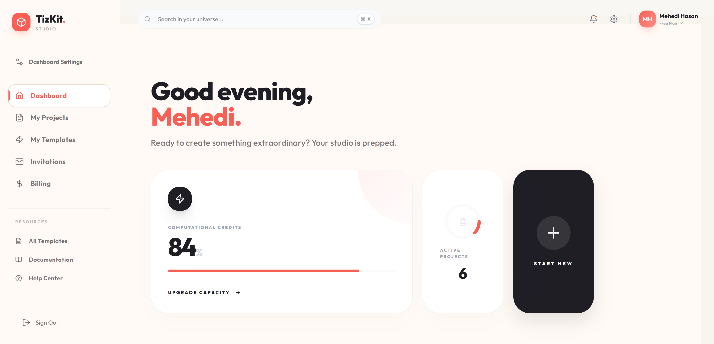 <br/> Main dashboard overview |
| 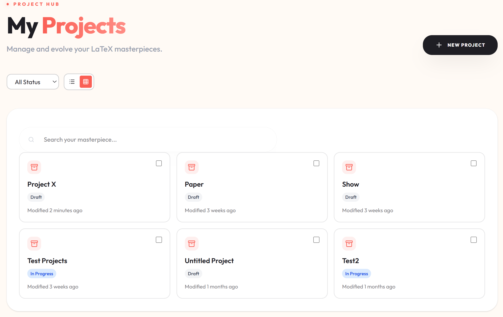 <br/> Project list & navigation | 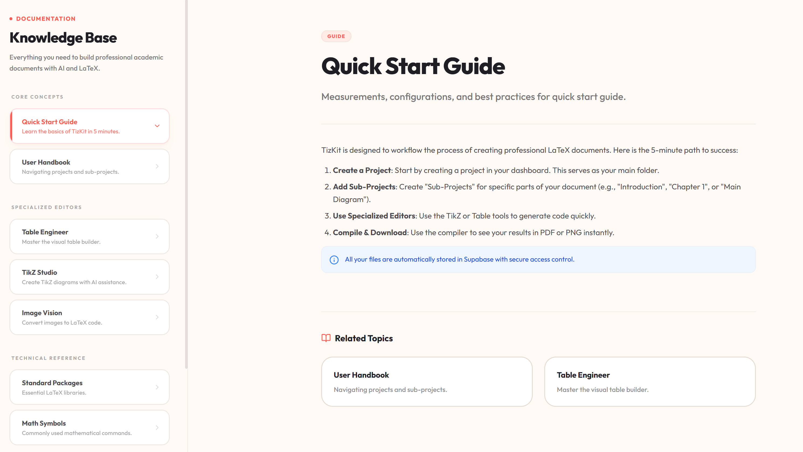 <br/> In-app docs & guides |

### Templates

| | | |
|---|---|---|
| 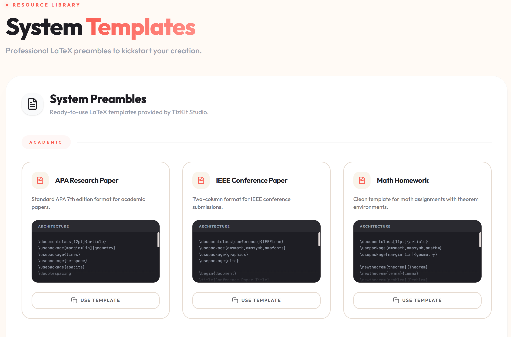 <br/> Built-in templates gallery | 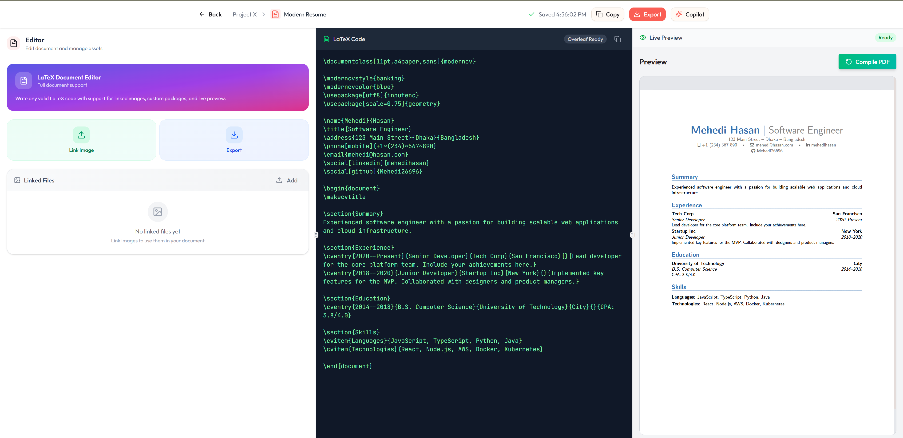 <br/> ModernCV resume template | 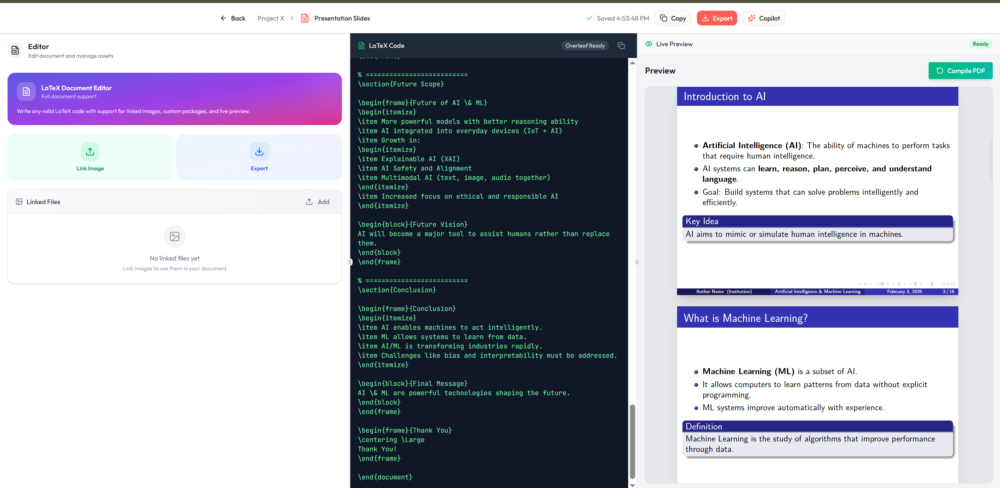 <br/> Beamer presentation template |

### Editors & AI

| | |
|---|---|
| 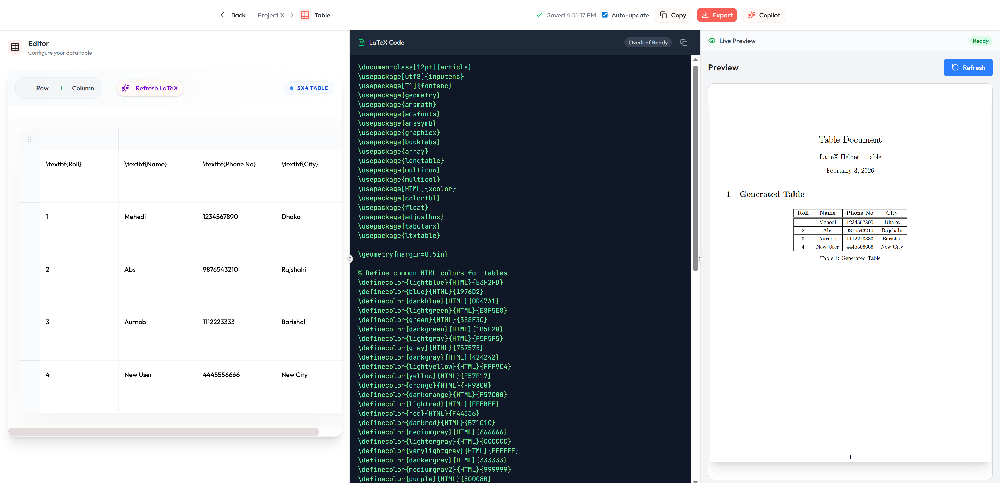 <br/> Visual table builder | 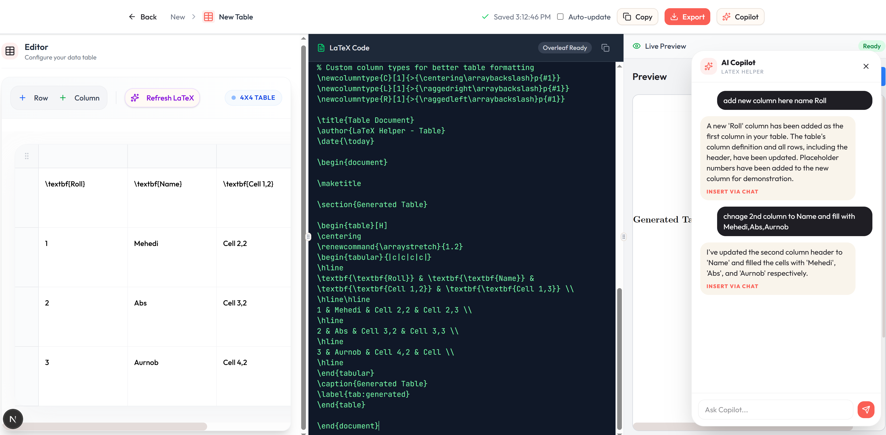 <br/> AI-assisted table generation |
|  <br/> AI-assisted diagram generation |  <br/> Handwritten-to-TikZ flowchart |

### Collaboration & Billing

| | | |
|---|---|---|
|  <br/> Collaboration invites | 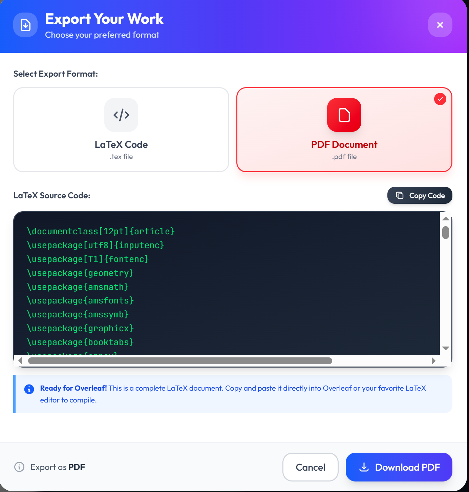 <br/> Export project outputs | 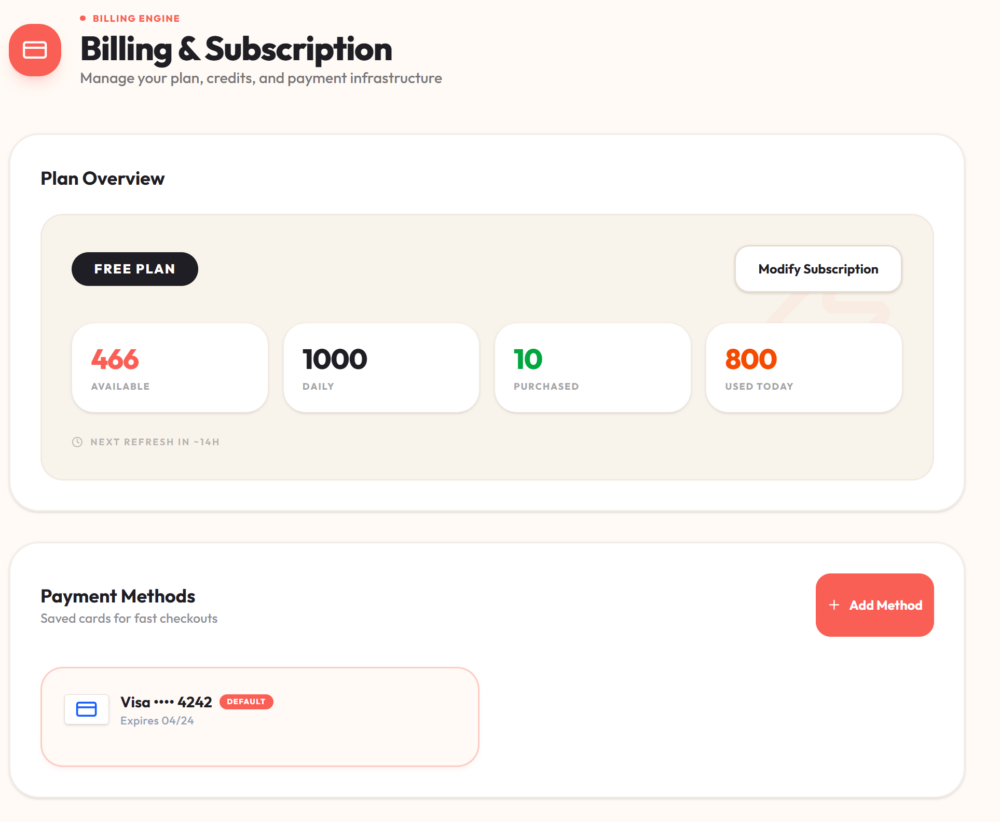 <br/> Credits & billing |

---

## 🏗 System Architecture

TizKit is a **Next.js + FastAPI** platform where you edit LaTeX as a workspace (projects + sub-projects) and use specialized tools (Table, Diagram, AI Vision) that all funnel into the same compile/preview pipeline.

### 1) What Runs Where

**Frontend (Next.js)**
- Hosts the UI and editors (projects, templates, marketplace, table/diagram builders).
- Talks to the backend using `NEXT_PUBLIC_API_URL`.
- Renders previews from backend responses (PDF/PNG blobs).

**Backend API (FastAPI)**
- Single API app that mounts feature routers (see `backend/src/__init__.py`).
- Key route groups:
  - **Workspace**: `/projects`, `/templates`, `/marketplace`, `/api` (collaboration)
  - **Editors/Engines**: `/table`, `/diagram`, `/image_to_latex`, `/handwritten_flowchart`
  - **AI**: `/ai`
  - **Auth/Credits**: `/auth`, `/credits`
  - **Health**: `/health`

**Persistence (Supabase)**
- PostgreSQL stores users/projects/sub-projects/credits/marketplace metadata.
- Storage (S3-compatible) stores uploaded assets and generated outputs.

**Engines**
- **Tectonic** compiles LaTeX to PDF/PNG.
- **Poppler** supports PDF tooling (where needed for preview/extract).
- **Gemini** and **OCR.space** power AI Vision + text extraction.

### 2) High-Level Architecture

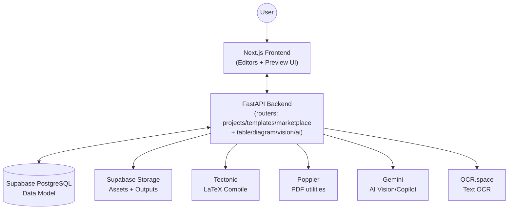

### 3) Core Flows (End-to-End)

#### A) Compile / Preview (PDF or PNG)
This is the backbone of the experience: every editor can produce a preview.
- Common endpoints: `/table/preview`, `/diagram/preview`, `/image_to_latex/preview`, `/handwritten_flowchart/compile`.

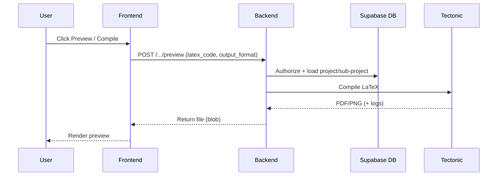

#### B) AI Vision (Image → LaTeX / Handwriting → TikZ)
Turns images into editable LaTeX/TikZ which can then be previewed via the same compile pipeline.
- Common endpoints: `/image_to_latex/pix2tex-formula`, `/handwritten_flowchart/generate-latex`.

#### C) Credits (User-Facing Behavior)
Some operations may be credit-protected.
- When credits are insufficient the backend can respond with **HTTP 402**; the frontend shows an upgrade/top-up flow.

---

## 🏢 Deep Dive: TizKit Features

### 1. 🏢 Project Management & Team Collaboration
TizKit organizes your work as Projects with specialized Sub-projects.
- **Projects**: Top-level containers for documents and assets.
- **Sub-projects**: Focused components such as **Document**, **Table**, **Diagram**, and AI-assisted extraction outputs.
- **Role-Based Access Control (RBAC)**:
    - **Owners**: Full authority. Can manage projects, billing, and collaborators.
    - **Collaborators**: Can edit content and trigger compilations. Restricted from destructive actions.
- **Invitations System**: Send, accept, and manage project invites via a dedicated UI.
- **Global Consistency**: Strict UTC synchronization for all project activities.

### 2. 🏪 Template Marketplace
TizKit features a comprehensive marketplace for LaTeX templates, allowing users to discover, use, and even monetize their creations.
- **Categories**: Browse through structured categories such as Academic, Professional (CV/Resume), Presentation, and Diagrams.
- **Community Driven**: Rate and review templates from other creators.
- **Monetization**: Support for both free and premium templates with an integrated credit system.
- **One-Click Import**: Clone a template into your own project space.

### 3. 📊 The Intelligent Table Engineer
Building complex tables in LaTeX (`\multirow`, `\multicolumn`, `\cmidrule`) is notoriously difficult. TizKit's **Table Editor** solves this.
- **Grid-First Interface**: An Excel-like experience where you can type directly into cells.
- **Structure Control**: Drag & Drop rows/columns, Merge/Split cells, and Sticky Headers.
- **Style Engine**: Apply bold, italic, alignment (L/C/R), and cell colors. The backend automatically generates clean `booktabs` and `colortbl` code.

### 4. 📐 Visual TikZ Studio
A `React-Konva` powered canvas for drawing vector graphics that compile to semantic TikZ code.
- **Node Library**: Drag rectangles, circles, diamonds, and logic gates onto the canvas.
- **Smart Connectors**: Draw arrows between nodes. Connectors are "sticky"—they stay attached even if you move the nodes.
- **Live Compilation**: The backend continuously translates your visual graph into `\node` and `\draw` commands.

### 5. 🧠 AI Vision & Copilot
Leveraging **Gemini (default: 2.5 Flash)** and OCR to bridge the analog-to-digital gap.
- **Image-to-LaTeX**: Extract semantic math structure from screenshots or textbook photos.
- **Handwritten Flowcharts**: Interpret hand-drawn sketches on paper and rebuild them as digital TikZ diagrams.
- **AI Copilot**: An interactive assistant that helps you write LaTeX, explain errors, and suggest improvements.
- **Self-Healing Code**: The AI attempts to autofix syntax errors detected in the Tectonic compilation logs.

> Tip: The backend supports an optional **Groq** fallback provider for some AI workloads (see `GROQ_API_KEY` in the backend config).

### 6. 📝 Pre-built & Custom Templates
- **System Templates**: Start instantly with professional defaults like:
    - **Modern Resume**: A clean, banking-style CV using `moderncv`.
    - **Presentation Slides**: A professional Beamer deck with the `Madrid` theme.
    - **Academic Paper**: Standard IEEE-style conference template.
    - **Homework Assignment**: Clean layout for math/science problem sets.
- **Personal Library**: Save your favorite preambles (packages, macros) as global templates.

Built-in “System Templates” live in the frontend as constants (see `frontend/lib/constants/prebuilt-projects.ts`).

---

## 🚀 The Detailed User Flow

### Step 1: Initialization
1.  **Sign Up/Login**: Secure authentication via JWT.
2.  **Dashboard**: You land on a dashboard showing your Projects and Pending Invitations.
3.  **Create Project**: Click "+ New Project". Choose a **System Template** (e.g., "Modern Resume", "Presentation Slides", "Academic Paper") or a **User Template**.

### Step 2: Asset Management
1.  **File Manager**: In the project view, upload your images (`.png`, `.jpg`) and `.bib` files.
2.  **Organization**: These files are stored in Supabase Storage and can be referenced by any sub-project.

### Step 3: Component Engineering (Sub-Projects)
Instead of writing one giant `main.tex`, you create specialized components:
1.  **Click "Add Sub-Project"**: Choose "Table", "Diagram", "Document", or "AI Assistant".
2.  **Table Workflow**:
    - Enter the visual editor, add data, merge cells, and style headers.
    - The backend generates clean `tabular` code automatically.
3.  **Diagram Workflow**:
    - Drag shapes and connect them with arrows on the canvas.
    - Real-time TikZ code generation and preview.
4.  **AI Vision Workflow**:
    - Upload an image or flowchart sketch.
    - AI converts it to editable LaTeX/TikZ code.

### Step 4: Assembly & Compilation
1.  **Main Document**: Go to the "Document" sub-project (your `main.tex`).
2.  **Integration**: You can copy-paste the code from your Table/Diagram sub-projects, or use TizKit's specialized reference system (future feature).
3.  **Preview**: Click **Compile**. The Tectonic engine builds the PDF.
4.  **Debug**: If there's an error, check the "Logs" tab. Use the "AI Fix" button to attempt an auto-repair.

### Step 5: Export & Collaboration
1.  **Share**: Invite your professor or colleague via email. They gain instant access to help edit.
2.  **Export**: Download the final PDF or click "Export Source" to get a `.zip` of all `.tex` and asset files.

---

## 🛠 Tech Stack & Tools

### **Frontend**
- **Framework**: Next.js 16 (App Router)
- **Language**: TypeScript, React 19
- **Styling**: Tailwind CSS 4, Shadcn UI, Framer Motion
- **Canvas**: React-Konva (for TikZ Diagrams)
- **Components**: Lucide React, Sonner (Toasts)

### **Backend**
- **Core**: FastAPI (Python 3.10+)
- **ORM**: SQLModel (SQLAlchemy 2.0)
- **Database**: PostgreSQL (managed via Supabase)
- **Migration**: Alembic
- **AI**: Gemini 2.0 Flash, OCR.space
- **LaTeX Engine**: Tectonic (Rust-based)

---

## 📂 Project Structure

```text
├── backend/
│   ├── alembic/            # Database migrations
│   ├── src/
│   │   ├── auth/           # Auth, Users, Projects, Credits
│   │   ├── ai/             # AI Copilot services
│   │   ├── Table/          # Table generation engine
│   │   ├── Diagram/        # TikZ diagram engine
│   │   ├── ImageToLatex/   # AI Vision & OCR
│   │   ├── marketplace/    # Template marketplace logic
│   │   └── utils/          # DB & Storage utilities
│   └── main.py             # Entry point
├── frontend/
│   ├── app/                # Next.js pages & layouts
│   ├── components/         # React components (UI, projects, marketplace)
│   ├── lib/
│   │   ├── api/            # API client & hooks
│   │   └── constants/      # Pre-built templates & config
│   └── services/           # Frontend business logic
└── tectonic/               # Local LaTeX distribution
```

---

## 💻 Installation (Local Dev)

### Prerequisites
- Python 3.10+
- Node.js 20+
- Supabase Account (for DB/Auth/Storage)

### 1. Clone & Config
```bash
git clone https://github.com/Mehedi26696/Latex-Helper---Tizkit.git
cd Latex-Helper---Tizkit
```

### 2. Backend Setup
```bash
cd backend
python -m venv venv
# Windows
.\venv\Scripts\Activate.ps1
# Linux/Mac
source venv/bin/activate

pip install -r requirements.txt
cp .env.example .env 
# REQUIRED: DATABASE_URL, SUPABASE_URL, SUPABASE_ANON_KEY, SECRET_KEY
# OPTIONAL (depending on features): SUPABASE_SERVICE_ROLE_KEY, GEMINI_API_KEY, OCR_SPACE_API_KEY, GROQ_API_KEY
# Local tool paths (Windows-friendly defaults exist): TECTONIC_PATH, POPPLER_PATH, LATEX_TIMEOUT
python main.py
```

### 3. Frontend Setup
```bash
cd frontend
npm install
echo "NEXT_PUBLIC_API_URL=http://localhost:8000" > .env.local
npm run dev
```

Visit `http://localhost:3000` to start engineering!

**Crafted with ❤️ by the TizKit Team.**
