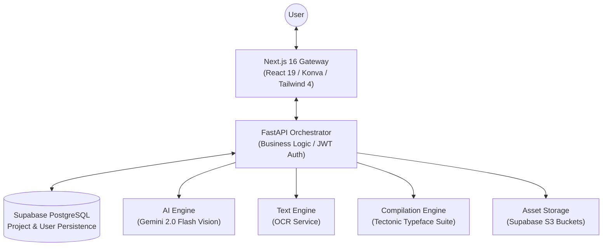
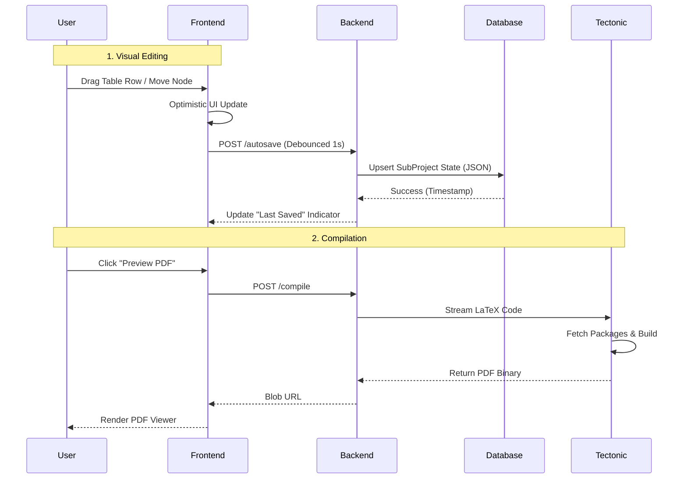

# TizKit — The Ultimate LaTeX Engineering Platform 🚀

[](https://nextjs.org/)
[](https://fastapi.tiangolo.com/)
[](https://supabase.com/)
[](LICENSE)

**TizKit** is a professional-grade, full-stack platform designed to revolutionize the way researchers, students, and engineers interact with LaTeX. By bridging the gap between complex typesetting code and intuitive visual design, TizKit provides a high-fidelity environment for generating publication-quality diagrams, tables, and documents through interactive editors and state-of-the-art AI Vision.

Unlike standard editors (Overleaf), TizKit focuses on **Component-Based Engineering**—allowing you to build complex tables and diagrams in specialized visual environments before assembling them into a final document.

---

## 🏗 System Architecture

TizKit is built on a distributed service architecture optimized for high concurrency, real-time visual feedback, and reliable data persistence via a cloud-native database.

### 🧩 High-Level Overview
The architecture offloads expense operations (AI, Compilation) to specialized micro-services while maintaining fluid UI state.



### ⚡ Complete Data Lifecycle
From a user's keystroke to the final cloud save.



---

## � Deep Dive: TizKit Features

### 1. 🏢 Project Management & Team Collaboration
Gone are the days of emailing `.tex` files. TizKit introduces a robust, permission-aware file system.
- **Mother Projects**: The top-level container holding all assets, templates, and sub-projects.
- **Role-Based Access Control (RBAC)**:
    - **Owners**: Full authority. Can delete projects, manage billing, and invite others.
    - **Collaborators**: Invited via email. Can edit content, upload files, and trigger compilations. Restricted from destructive actions (Delete Project).
- **Invitations System**: A dedicated UI for sending, accepting, and rejecting project invites.
- **Timezone Intelligence**: All timestamps are serialized in strict UTC to ensure global team members see consistent "Last Modified" times.

### 2. � The Intelligent Table Engineer
Building complex tables in LaTeX (`\multirow`, `\multicolumn`, `\cmidrule`) is notoriously difficult. TizKit's **Table Editor** solves this.
- **Grid-First Interface**: An Excel-like experience where you can type directly into cells.
- **Structure Control**:
    - **Drag & Drop**: Reorder rows and columns instantly.
    - **Merge/Split**: Visual controls for spanning cells.
    - **Sticky Headers**: Manage massive datasets without losing context.
- **Style Engine**: Apply bold, italic, alignment (L/C/R), and cell colors. The backend automatically generates the necessary `booktabs` and `colortbl` code.

### 3. 📐 Visual TikZ Studio
A `React-Konva` powered canvas for drawing vector graphics that compile to semantic TikZ code.
- **Node Library**: Drag rectangles, circles, diamonds, and logic gates onto the canvas.
- **Smart Connectors**: Draw arrows between nodes. Connectors are "sticky"—they stay attached even if you move the nodes.
- **Live Compilation**: The backend continuously translates your visual graph into `\node` and `\draw` commands, giving you a real-time PDF preview.

### 4. 🧠 AI Vision Pipeline
Leveraging **Gemini 2.0 Flash** and advanced OCR to bridge the analog-to-digital gap.
- **Image-to-LaTeX**: Upload a screenshot of a textbook formula. The AI extracts the semantic math structure (not just characters) and outputs editable LaTeX.
- **Handwritten Flowcharts**: Sketch a diagram on paper, upload it, and TizKit's vision pipeline interprets the shapes and connections to rebuild it as a digital TikZ diagram.
- **Self-Healing Code**: If Tectonic compilation fails, the error log is fed back into the AI, which attempts to autofix syntax errors (missing brackets, undefined packages).

### 5. 📝 User Templates
- **Personal Library**: Save your favorite preambles (packages, macros) as global templates.
- **One-Click Start**: Initialize new projects using "IEEE Conference", "APA", or your custom "Thesis Template".

---

## 🚀 The Detailed User Flow

### Step 1: Initialization
1.  **Sign Up/Login**: Secure authentication via JWT.
2.  **Dashboard**: You land on a dashboard showing your Projects and Pending Invitations.
3.  **Create Project**: Click "+ New Project". Choose a **System Template** (e.g., "Empty", "Article", "Beamer") or a **User Template**.

### Step 2: Asset Management
1.  **File Manager**: In the project view, upload your images (`.png`, `.jpg`) and `.bib` files.
2.  **Organization**: These files are stored in Supabase Storage and can be referenced by any sub-project.

### Step 3: Component Engineering (Sub-Projects)
Instead of writing one giant `main.tex`, you create specialized components:
1.  **Click "Add Sub-Project"**: Choose "Table", "Diagram", or "Document".
2.  **Table Workflow**:
    - Enter the visual editor.
    - Add data, merge cells, style headers.
    - Click "Save" (or Ctrl+S).
    - The generated code (e.g., `\begin{tabular}...`) is saved.
3.  **Diagram Workflow**:
    - Drag shapes onto the canvas.
    - Connect them with arrows.
    - The backend generates `\begin{tikzpicture}...`.

### Step 4: Assembly & Compilation
1.  **Main Document**: Go to the "Document" sub-project (your `main.tex`).
2.  **Integration**: You can copy-paste the code from your Table/Diagram sub-projects, or use TizKit's specialized reference system (future feature).
3.  **Preview**: Click **Compile**. The Tectonic engine builds the PDF.
4.  **Debug**: If there's an error, check the "Logs" tab. Use the "AI Fix" button to attempt an auto-repair.

### Step 5: Export & Collaboration
1.  **Share**: Invite your professor or colleague via email. They gain instant access to help edit.
2.  **Export**: Download the final PDF or click "Export Source" to get a `.zip` of all `.tex` and asset files.

---

## 🛠 Tech Stack & Tools

### **Frontend**
- **Framework**: Next.js 16 (App Router)
- **State**: React 19 w/ Server Components
- **Styling**: Tailwind CSS 4, Shadcn UI, Lucide React
- **Canvas**: React-Konva
- **Utils**: Sonner (Toast), Framer Motion (Animations)

### **Backend**
- **Core**: FastAPI (Python 3.10+)
- **ORM**: SQLModel (SQLAlchemy 2.0)
- **Database**: PostgreSQL (Supabase)
- **Storage**: S3-compatible (Supabase Storage)
- **LaTeX Engine**: Tectonic (Rust-based distribution)

---

## � Installation (Local Dev)

### Prerequisites
- Python 3.10+
- Node.js 20+
- Supabase Account (for DB/Auth/Storage)

### 1. Clone & Config
```bash
git clone https://github.com/Mehedi26696/Latex-Helper---Tizkit.git
cd Latex-Helper---Tizkit
```

### 2. Backend Setup
```bash
cd backend
python -m venv venv
# Windows
.\venv\Scripts\Activate.ps1
# Linux/Mac
source venv/bin/activate

pip install -r requirements.txt
cp .env.example .env 
# FILL IN: SUPABASE_URL, SUPABASE_KEY, GEMINI_API_KEY
python main.py
```

### 3. Frontend Setup
```bash
cd frontend
npm install
echo "NEXT_PUBLIC_API_URL=http://localhost:8000" > .env.local
npm run dev
```

Visit `http://localhost:3000` to start engineering!

---

## ⌨️ Productivity Shortcuts

| Shortcut | Function | Context |
|----------|----------|---------|
| `Ctrl + S` | Force Save to Cloud | All Editors |
| `Ctrl + Enter`| Quick Compile | Document Editor |
| `Ctrl + /` | Toggle Help | Global |
| `Esc` | Deselect / Close Modal | UI |

---

**Crafted with ❤️ by the TizKit Team.**
